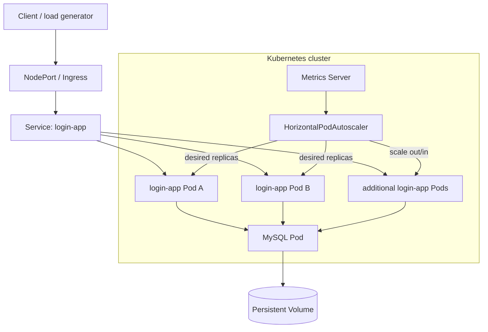

# Architecture

## Scope

This repository is a Kubernetes infrastructure lab around a small Node.js + MySQL workload. The infrastructure—not the demo application's business logic—is the primary subject.

## Retained topology

## Components

### Web workload

The lab workload is an Express application packaged with a Dockerfile. It exposes a `/health` endpoint and connects to MySQL using environment variables populated from Kubernetes configuration.

The workload is deliberately small so infrastructure behavior can be observed without a complex application domain.

### Kubernetes Deployment

The `login-app` workload is represented by Deployment manifests. A load-balancing variant retains multiple replicas and exposes pod/node identity information to make request distribution observable.

### Service and Ingress

Kubernetes Service provides stable service discovery and distribution across healthy replicas. An NGINX Ingress experiment adds another traffic-entry layer and demonstrates how ingress routing differs from direct NodePort access.

### Health probes

The load-balancing deployment contains readiness and liveness checks against `/health`.

Their responsibilities differ:

- **readiness** determines whether a pod should receive service traffic;
- **liveness** determines whether Kubernetes should restart a container that is no longer healthy.

### MySQL and persistence

The repository retains MySQL Deployment, Service, Secret-template, PV, and PVC manifests. This demonstrates the relationship between stateless application replicas and a stateful backing service.

The storage configuration is a lab-oriented local-volume setup, not a production high-availability database design.

### Metrics Server and HPA

Metrics Server exposes resource metrics through the Kubernetes metrics API. The retained HPA consumes CPU utilization and adjusts the desired replica count of `Deployment/login-app` within configured bounds.

See [AUTOSCALING.md](./AUTOSCALING.md).

## Design lessons

This lab demonstrates several operational boundaries that are easy to miss in a basic Kubernetes tutorial:

- adding replicas is only useful when traffic can be routed to them;
- autoscaling depends on metrics availability and appropriate resource requests;
- readiness protects traffic routing while liveness protects container recovery;
- stateful dependencies scale differently from stateless frontends;
- scale-up and scale-down policies should not necessarily be symmetric;
- ingress, services, deployments, metrics, and storage are separate control-plane concerns.

## What this architecture does not claim

The retained repository does not establish production-grade guarantees such as multi-zone availability, managed database failover, PodDisruptionBudgets, network policies, TLS automation, GitOps, cluster autoscaling, or workload identity.

Those are discussed as natural production extensions rather than historical implementation claims.
