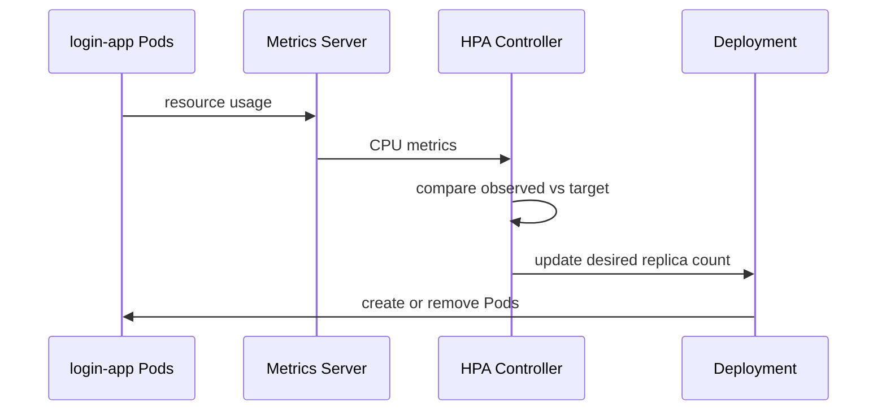

# Horizontal Pod Autoscaling

## Retained configuration

The repository contains an `autoscaling/v2` HorizontalPodAutoscaler at:

`k8s-login-app/k8s/login-app-hpa.yaml`

It targets `Deployment/login-app` and retains the following settings:

| Parameter | Value |
|---|---:|
| `minReplicas` | 2 |
| `maxReplicas` | 4 |
| Metric | CPU utilization |
| Target | 80% average utilization |
| Scale-up stabilization | 60 s |
| Scale-down stabilization | 300 s |

The scale-down behavior includes two policies—percentage based and pod-count based—and selects the minimum policy. This makes scale-in deliberately more conservative than scale-out.

## Resource baseline

The repository also retains `k8s-login-app/k8s/cpu-patch.yaml`:

```yaml
resources:
  requests:
    cpu: 100m
    memory: 128Mi
  limits:
    cpu: 500m
    memory: 512Mi
```

This matters because a percentage-based CPU HPA evaluates utilization relative to the container's requested CPU.

For the retained lab values, an 80% target against a `100m` request corresponds to roughly `80m` average CPU usage per pod as the target reference point. That is a configuration interpretation, not a measured benchmark result.

Apply the resource patch before evaluating percentage-based CPU HPA behavior:

```bash
kubectl patch deployment login-app --patch-file k8s-login-app/k8s/cpu-patch.yaml
```

## Control loop



## Suggested verification flow

These commands are useful for reproducing the behavior in a disposable lab:

```bash
kubectl top pods
kubectl get hpa
kubectl describe hpa login-app-hpa
kubectl get hpa -w
kubectl get pods -w
```

Generate controlled traffic against the service while watching HPA and pod state. The important evidence is not simply that pod count changes; a useful observation includes:

- current CPU metric;
- desired vs current replicas;
- how long the target remains above threshold;
- scale-up delay / stabilization;
- scale-down delay;
- whether new pods become Ready before receiving traffic.

## What can be claimed from the repository

The retained manifests are evidence that the lab configured:

- CPU requests and limits for the web workload;
- CPU-based HPA;
- explicit minimum/maximum replicas;
- explicit stabilization behavior.

The repository does **not** currently retain a structured benchmark dataset proving a specific requests-per-second threshold, scaling latency, or throughput improvement. Those figures should not be invented for a CV or portfolio.

## Production follow-ups

For a production service, the next questions would include:

- whether CPU is the right demand signal;
- whether memory, queue depth, or application metrics are more meaningful;
- appropriate min/max replicas from capacity tests;
- PodDisruptionBudget and topology spread;
- cluster autoscaler interaction;
- startup behavior and cold-start cost;
- alerting for HPA saturation at `maxReplicas`.

These are production-readiness recommendations, not historical implementation claims.
