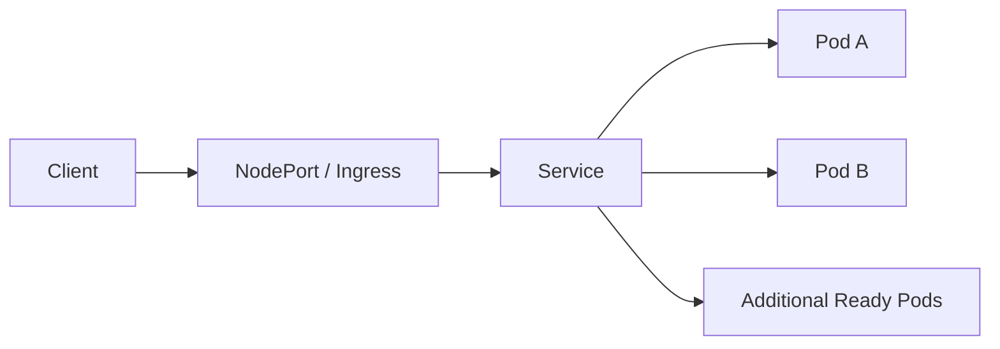

# Load Balancing

## What the lab explores

The project uses multiple `login-app` replicas behind Kubernetes networking primitives to observe how traffic reaches healthy pods.

Retained artifacts include:

- `k8s-login-app/k8s/web-deployment.yaml`
- `k8s-login-app/k8s/web-deployment-lb.yaml`
- `k8s-login-app/k8s/web-service.yaml`
- `k8s-login-app/k8s/web-service-lb.yaml`
- `k8s-login-app/k8s/login-app-ingress.yaml`
- `k8s-login-app/app/server-patch.js`

## Request path



Kubernetes Service gives the workload a stable endpoint while pods can be created and removed underneath it. This is important when the HPA changes replica count.

## Pod identity experiment

The repository contains a small server-identification patch that exposes pod and node information. This is useful in a lab because repeated requests can show which replica served the request.

It demonstrates the difference between:

- **scaling** — changing the number of replicas;
- **service discovery** — finding the workload through a stable name/address;
- **traffic distribution** — sending requests across Ready replicas.

## Health checks

The load-balancing deployment variant uses `/health` for readiness and liveness probes.

Readiness is particularly important for load balancing: a pod that exists but is not Ready should not receive normal Service traffic.

## Ingress

The repository also includes an NGINX Ingress experiment. Ingress is documented as an additional routing layer, not as evidence of a managed cloud load balancer or production ingress architecture.

## Verification

A practical verification sequence is:

```bash
kubectl get deployment login-app
kubectl get pods -l app=login-app -o wide
kubectl get svc
kubectl get ingress
```

Then send repeated requests to the lab endpoint and compare returned pod identity while watching readiness state.

## Limitations

The repository does not retain a formal latency/throughput benchmark comparing one replica against multiple replicas. It therefore does not claim a quantified performance gain.

For production, useful extensions would include TLS, rate limiting, topology-aware routing, disruption budgets, multi-zone placement, connection-draining behavior, and load testing with recorded p50/p95/p99 latency.
