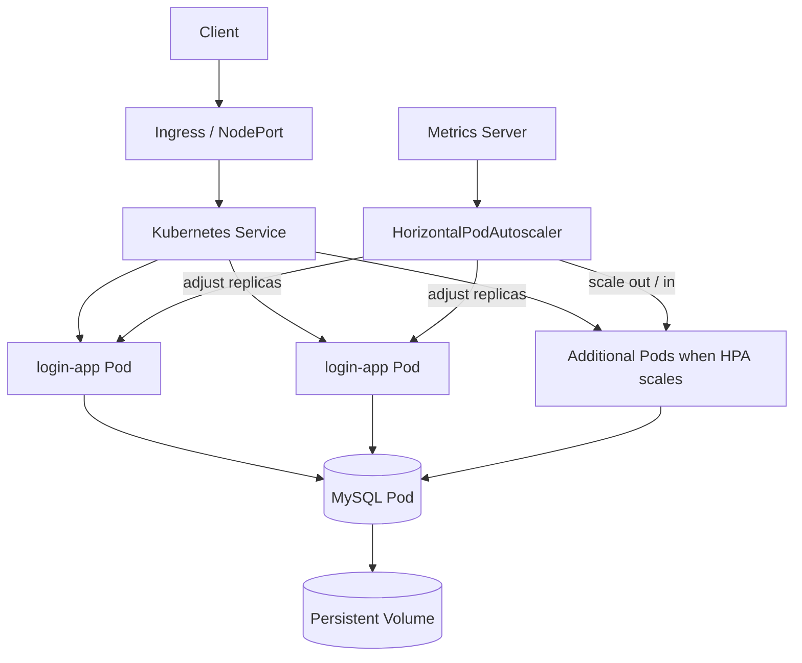

# Kubernetes Autoscaling & Load-Balancing Lab

[](./AUTOSCALING.md)
[](./OBSERVABILITY.md)
[](./ARCHITECTURE.md)
[](./scripts/validate_k8s_manifests.py)
[](./COURSEWORK_CONTEXT.md)
[](./TEAM_ATTRIBUTION.md)

A hands-on infrastructure coursework repository for deploying a small web workload on Kubernetes and exploring **Horizontal Pod Autoscaling (HPA), service load balancing, ingress, health checks, storage, and cluster metrics**.

**Syifani Adillah Salsabila served as Group Lead / Ketua Kelompok for this three-person team project**, while also participating in the technical lab work.

This repository originated from FILKOM coursework in May 2026. The assignment explicitly asked students to follow lecturer-provided Kubernetes material, so this portfolio version separates:

1. **course/reference material**, which should not be interpreted as original authorship;
2. **retained implementation artifacts** in this repository;
3. **portfolio analysis**, which explains what the artifacts demonstrate and where the limitations are.

> **Evidence rule:** documentation in this repository does not claim that every tutorial step or optional monitoring experiment was executed successfully. Claims are tied to retained manifests, application source, or explicit coursework context.

## Team

| Member | Role |
|---|---|
| **Syifani Adillah Salsabila** | **Group Lead / Ketua Kelompok** |
| Latifa Anggia Fitriana | Team Member |
| Jonathan Salim | Team Member |

See [TEAM_ATTRIBUTION.md](./TEAM_ATTRIBUTION.md) for collaboration and attribution notes.

## What this repository demonstrates

The retained project contains a small Node.js + MySQL application and Kubernetes manifests for:

- multi-replica application deployment;
- Kubernetes Service-based traffic distribution;
- NGINX Ingress experimentation;
- readiness and liveness probes;
- PersistentVolume / PersistentVolumeClaim-backed MySQL storage;
- Metrics Server integration;
- CPU-driven Horizontal Pod Autoscaling;
- scale-up / scale-down stabilization behavior;
- deployment troubleshooting and operational checks;
- optional Ansible automation and Prometheus/Grafana exploration.

The strongest autoscaling artifact is [`k8s-login-app/k8s/login-app-hpa.yaml`](./k8s-login-app/k8s/login-app-hpa.yaml):

```yaml
minReplicas: 2
maxReplicas: 4
averageUtilization: 80
```

The HPA also retains explicit stabilization behavior for scale-up and scale-down, which makes this more than a basic `kubectl autoscale` exercise.

## Architecture



See [ARCHITECTURE.md](./ARCHITECTURE.md).

## Autoscaling configuration

The retained HPA targets `Deployment/login-app` using `autoscaling/v2`.

| Setting | Retained value |
|---|---:|
| Minimum replicas | 2 |
| Maximum replicas | 4 |
| CPU target | 80% average utilization |
| CPU request baseline | 100m |
| CPU limit | 500m |
| Scale-up stabilization | 60 seconds |
| Scale-down stabilization | 300 seconds |
| Scale-down policy | conservative, minimum selected policy |

See [AUTOSCALING.md](./AUTOSCALING.md).

## Executable manifest integrity checks

The retained manifests are now guarded by a small deterministic validator so a reviewer can distinguish **configuration evidence** from narrative documentation.

[`scripts/validate_k8s_manifests.py`](./scripts/validate_k8s_manifests.py) parses every Kubernetes YAML file and verifies several cross-resource invariants:

- secret-like values in the public `Secret` manifest remain placeholders;
- `Deployment/login-app` selector and Pod-template labels match;
- the application container exposes port `3000`;
- liveness and readiness probes target `/health:3000`;
- database/session settings are sourced from `mysql-secret` instead of embedded credentials;
- `Service/login-app` selects the same Pods and forwards to port `3000`;
- HPA still targets `Deployment/login-app` with bounds `2..4`, CPU target `80%`, and `60s/300s` stabilization windows.

GitHub Actions executes these checks on pushes and pull requests through [`.github/workflows/manifest-validation.yml`](./.github/workflows/manifest-validation.yml).

> This is **static configuration validation**, not a substitute for `kubectl apply --dry-run=server`, live scheduling, Metrics Server availability, traffic generation, or an end-to-end cluster test.

## Application workload

The repository includes a small Express application used as a workload for the Kubernetes exercises. It provides:

- registration and login;
- a protected dashboard flow;
- image upload;
- `/health` endpoint for Kubernetes probes;
- MySQL persistence;
- server/pod identification experiments for observing load balancing.

This application is a **lab workload**, not the primary portfolio claim. The infrastructure behavior is the focus.

## Load balancing

The project retains:

- a multi-replica `Deployment`;
- a Kubernetes `Service`;
- a load-balancing deployment variant;
- an NGINX Ingress manifest;
- pod and node identity exposure for observing request distribution;
- readiness/liveness probes to keep unhealthy replicas out of service traffic.

See [LOAD_BALANCING.md](./LOAD_BALANCING.md).

## Metrics and observability

Metrics Server is retained in the repository because HPA needs resource metrics. The repository also contains Prometheus/Grafana setup notes as a broader monitoring experiment.

The portfolio makes a distinction here:

- **Metrics Server + HPA manifests:** retained implementation evidence;
- **Prometheus/Grafana document:** monitoring setup/exploration, not proof that a persistent production monitoring stack was operated.

See [OBSERVABILITY.md](./OBSERVABILITY.md).

## Repository navigation

| Topic | Document |
|---|---|
| Architecture | [ARCHITECTURE.md](./ARCHITECTURE.md) |
| HPA and scaling behavior | [AUTOSCALING.md](./AUTOSCALING.md) |
| Service / Ingress traffic distribution | [LOAD_BALANCING.md](./LOAD_BALANCING.md) |
| Metrics and monitoring | [OBSERVABILITY.md](./OBSERVABILITY.md) |
| Sanitized deployment walkthrough | [DEPLOYMENT.md](./DEPLOYMENT.md) |
| Manifest integrity validator | [scripts/validate_k8s_manifests.py](./scripts/validate_k8s_manifests.py) |
| Ansible automation experiment | [ANSIBLE_AUTOMATION.md](./ANSIBLE_AUTOMATION.md) |
| Coursework provenance | [COURSEWORK_CONTEXT.md](./COURSEWORK_CONTEXT.md) |
| Evidence map | [SOURCE_EVIDENCE.md](./SOURCE_EVIDENCE.md) |
| Team / collaboration attribution | [TEAM_ATTRIBUTION.md](./TEAM_ATTRIBUTION.md) |
| Security review | [SECURITY.md](./SECURITY.md) |
| Limitations / non-claims | [LIMITATIONS.md](./LIMITATIONS.md) |
| Portfolio / CV copy | [PORTFOLIO.md](./PORTFOLIO.md) |

## Important source attribution

The May 2026 assignment instructed students to follow lecturer-provided material, including:

- `Widhi-yahya/kubernetes_installation_docker`
- the lecturer's `LB_DEPLOYMENT.md` tutorial
- a course worksheet submitted separately as PDF documentation

For that reason, the original step-by-step installation/tutorial text is **not presented as original technical writing by Syifani**. The portfolio focuses instead on retained manifests, workload configuration, scaling policy, troubleshooting decisions, team coordination, and the resulting infrastructure understanding.

See [COURSEWORK_CONTEXT.md](./COURSEWORK_CONTEXT.md), [SOURCE_EVIDENCE.md](./SOURCE_EVIDENCE.md), and [TEAM_ATTRIBUTION.md](./TEAM_ATTRIBUTION.md).

## Security cleanup

The historical lab documentation contained environment-specific IP addresses, demo credentials, and a database password. The portfolio version removes those values from the current branch and replaces them with placeholders or environment variables.

The demo application now requires `DB_PASSWORD` and `SESSION_SECRET` from the environment rather than embedding the historical lab values, and the Kubernetes Secret manifest contains placeholders only.

Historical commits may still preserve old coursework values, so **none of those values should ever be reused**.

See [SECURITY.md](./SECURITY.md).

## Portfolio positioning

A concise recruiter-facing description:

> **Kubernetes Autoscaling & Load-Balancing Lab — Group Lead** — Led a three-person FILKOM coursework team deploying a containerized Node.js/MySQL workload on a multi-node Kubernetes lab. Configured service-based traffic distribution, health probes, persistent storage, Metrics Server, and an `autoscaling/v2` HPA with bounded replica scaling and stabilization policies; extended the lab with ingress, load-balancing verification, monitoring notes, and deployment automation experiments.

**Project type:** Infrastructure / Kubernetes / DevOps coursework  
**Role:** Group Lead / Ketua Kelompok  
**Context:** FILKOM Universitas Brawijaya — May 2026
